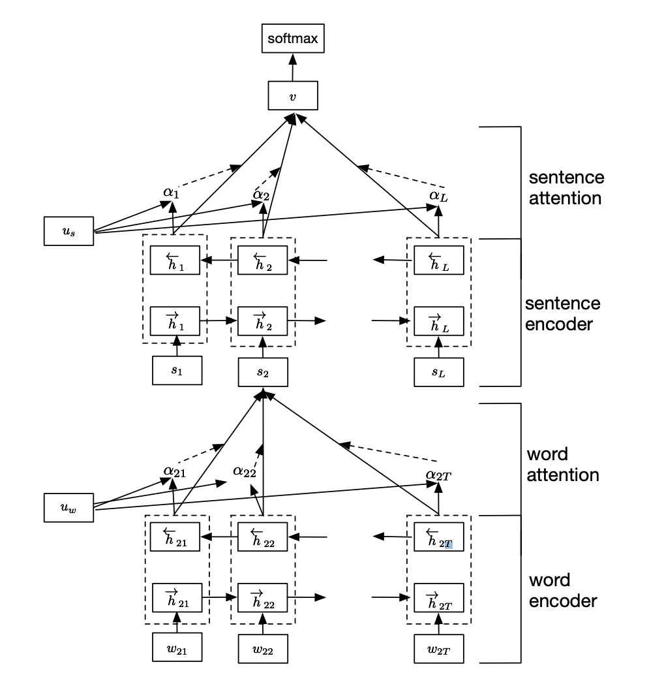

# Hierarchical Attention Networks for document classification

### HANs Architecture



### Installation and setup

Install [Python 3](https://www.python.org/downloads/release/python-3610/) and [pip](https://pypi.org/project/pip/) and clone this project:

```
$ mkdir ~/HANs
$ cd ~/HANs
$ git clone https://github.com/ntt261298/HANs-for-document-classification.git
```
Set up [Virtualenv](https://virtualenv.pypa.io/en/stable/):
```
$ pip install virtualenv
$ cd ~/
$ virtualenv env
$ source ~/env/bin/activate
```
Install project dependencies:
```
$ cd ~/HANs
$ pip install -r requirements.txt
```
Install Jupyter Notebook
```
$ pip install notebook
```
Add environment to Jupyter Notebook
```
$ pip install ipykernel
$ python -m ipykernel install --user --name=virtualenv
```
Run Jupter Notebook
```
jupyter notebook
```
** If you don't want to setup locally, [Google Colab](https://colab.research.google.com/) is a good choice with free GPU; Go there, create a new account (if you don't have one) and upload the notebook.

Download datasets
```
Amazon fine food: https://www.kaggle.com/snap/amazon-fine-food-reviews?select=database.sqlite

Glove word vector: http://nlp.stanford.edu/data/glove.6B.zip
```
